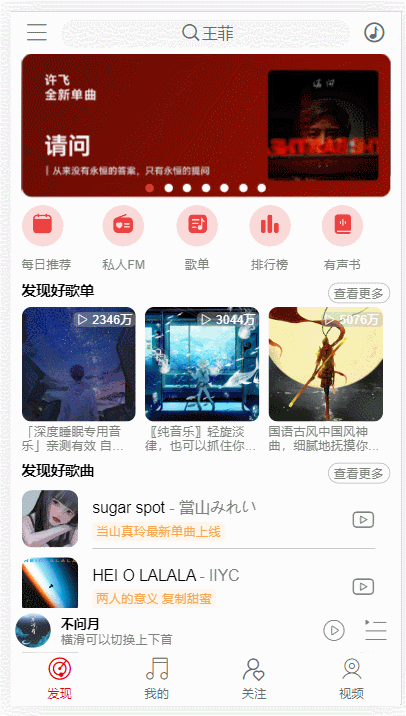

## :musical_note: 项目描述

---

使用 vue3 全家桶和 axios 技术，开发出仿网易云音乐的 app，部分功能待完善

<div style="width:100vw; float:left;"> 
     
     
    
</div>

## :chart_with_upwards_trend: 如何运行

---

### 1.开启本地接口 API

:link: [接口文档](https://neteasecloudmusicapi-docs.4everland.app/#/?id=neteasecloudmusicapi)

1. 将代码克隆到本地
2. 本地运行，默认的端口是 3000，所以代码中 axios 请求网络的 baseURL 为`"http://localhost:3000"`如果
   更改了端口记得把代码里面的端口也更改

### 2.安装项目所需的依赖

```
npm install
```

### 3.本地开发启动项目

```
npm run serve
```

### 4. 打包

```
npm run build
```

## :heavy_check_mark: 功能列表

---

## :memo: todoList

---

- 登录后，默认的播放歌单变为用户的歌单，而不是推荐歌单
